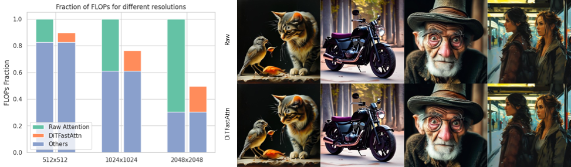
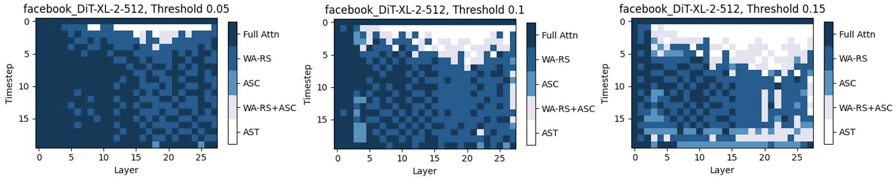

# DiTFastAttn: Attention Compression for Diffusion Transformer Models



Diffusion Transformers (DiT) excel at image and video generation but face computational challenges due to self-attention's quadratic complexity. We propose DiTFastAttn, a novel post-training compression method to alleviate DiT's computational bottleneck. We identify three key redundancies in the attention computation during DiT inference:
1. Spatial redundancy, where many attention heads focus on local information.
2. Temporal redundancy, with high similarity between neighboring steps' attention outputs.
3. Conditional redundancy, where conditional and unconditional inferences exhibit significant similarity.

To tackle these redundancies, we propose three techniques:
1. Window Attention with Residual Caching to reduce spatial redundancy.
2. Temporal Similarity Reduction to exploit the similarity between steps.
3. Conditional Redundancy Elimination to skip redundant computations during conditional generation.

Please read our [paper](https://openreview.net/pdf?id=51HQpkQy3t) for more detailed information.



# Install

```
conda create -n difa python=3.10
```


```
pip install torch numpy packaging matplotlib scikit-image ninja
pip install git+https://github.com/huggingface/diffusers
pip install thop pytorch_fid torchmetrics accelerate torchmetrics[image] beautifulsoup4 ftfy flash-attn transformers SentencePiece
```

# Prepare dataset

Sample real images to `data/real_images` from ImageNet to compute the IS and FID:
```
python data/sample_real_images.py <imagenet_path>
```

If you will use Pixart, place coco dataset to `data/mscoco`.

# Usage
All the experiment code can be found in folder `experiments/`.

DiT compression:
```
python run_dit.py --n_calib 8 --n_steps 50 --window_size 128 --threshold 0.05 --eval_n_images 5000
```

PixArt 1k compression:
```
python run_pixart.py --n_calib 6 --n_steps 50 --window_size 512 --threshold 0.0725 --eval_n_images 5000

```

Opensora compression:
```
python run_opensora.py --threshold 0.05 --window_size 50 --n_calib 4 --use_cache
```
Note that before using opensora, you should install the opensora according to the readme from `https://github.com/hpcaitech/Open-Sora`. Because the opensora is under development. You should switch to commit id `ea41df3d6cc5f38` of opensora if you meet some problem.

# Updates

Check CHANGELOGS.md for updates

# Citation

```
@inproceedings{
      yuan2024ditfastattn,
      title={Di{TF}astAttn: Attention Compression for Diffusion Transformer Models},
      author={Zhihang Yuan and Hanling Zhang and Lu Pu and Xuefei Ning and Linfeng Zhang and Tianchen Zhao and Shengen Yan and Guohao Dai and Yu Wang},
      booktitle={The Thirty-eighth Annual Conference on Neural Information Processing Systems},
      year={2024},
      url={https://openreview.net/forum?id=51HQpkQy3t}
}
```